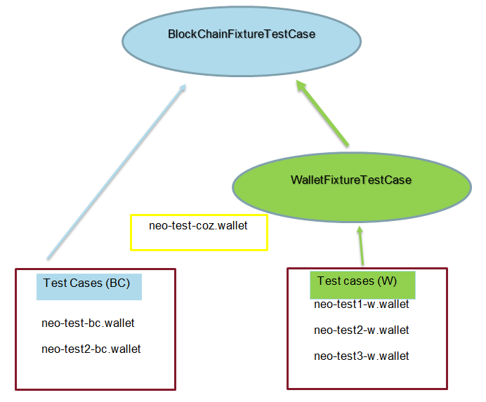

Tests
-----

Run tests with the following command

.. code-block:: sh

    make test

Run style checks with this command

.. code-block:: sh

    make lint

You can run only the ``neo-python`` tests with this command:

.. code-block:: sh

  python -m unittest discover neo

And run only tests from the ``neo-boa`` project like this:

.. code-block:: sh

  python -m unittest discover boa_test

If you are adding tests or altering functionality, it might be faster to only run a single test.  This can be done like this:

.. code-block:: sh

  python -m unittest neo/test_settings.py

  

Fixtures Guidelines
-------------------

The following guideline is relevant to all the ``unit-tests`` which are depending either on ``BlockChainFixtureTestCase`` or ``WalletFixtureTestCase``. 
Such tests rely on fixtures which are produced by a ``neo-python-privnet-unittest`` image. The image is currently located here: `link <https://hub.docker.com/r/cityofzion/neo-python-privnet-unittest/tags/>`_

- The tests which depend directly on  ``BlockChainFixtureTestCase`` are generated using transactions between addresses contained in BC wallets: (``neo-test-bc.wallet``, ``neo-test2-bc.wallet``). 
  Occasionally we have also used, in few tests, the default address in ``neo-test-coz.wallet``. The coz wallet is special as it is the original coz privnet wallet with 100000000 NEO. 

- The tests which depend directly on  ``WalletFixtureTestCase`` are generated using transactions between addresses contained in W wallets (``neo-test1-w.wallet``, ``neo-test2-w.wallet``, ``neo-test3-w.wallet``).
  
 A picture may help to visualize the tests BC and W:

When adding new tests to the privnet fixtures try to follow the following guidelines in order to minimize the dependencies between unit-tests:
 
a) We should strive to not use directly the ``neo-test-coz.wallet`` in any tests as it is expected to be the source of NEO and GAS for other test wallet and it is natural that it will change quite a bit in due course of time. 
   If we create tests which involve the ``neo-test-coz.wallet``, then we should be ready to update them frequently. 
   This is not good from a maintenance perspective.
b) Try to re-use existing transactions on the privnet fixture for creating new tests.
c) Add new transactions to the privnet fixture only when required as this will add the risk to break existing tests. 
   We are aware that we have a couple of assertions related tot the blockchain‘s height and wallet‘s height. 
   These tests inevitably need to be updated after adding new transactions to the privnet fixtures.
d) Create your own token if you want to be sure to isolate your tests.
e) Create new wallets only if absolutely necessary. 

**The last three points c), d), e) required updating the fixtures:**

1) Pull the lastet `neo-python-privnet-unittest <https://hub.docker.com/r/cityofzion/neo-python-privnet-unittest/tags/>`_ image:

.. code-block:: sh

	docker pull cityofzion/neo-python-privnet-unittest:v0.0.xx

2) Run the image:

.. code-block:: sh
	
	docker run --rm -d --name neo-privnet-unittest -p 20333-20336:20333-20336/tcp -p 30333-30336:30333-30336/tcp dautt/neo-privnet-unittest:v0.0.xx``

3) Clean the current ``unittest`` chain:

.. code-block:: sh
	
	rm -rf ~/.neopython/Chains/unittest
	rm -rf ~/.neopython/Chains/unittest_notif

4) Activate your virtual environment:

.. code-block:: sh
	
	source venv/bin/activate

5) Start the neo node:

.. code-block:: sh
	
	python prompt.py -u

6) Use the following wallets for generating transactions:

.. code-block:: sh

	neo-test-coz.wallet	(pwd = coz)							
	neo-test1-bc.wallet	(pwd = 1234567890) 
	neo-test2-bc.wallet	(pwd = 1234567890)                                                                                                                   	                  
	neo-test1-w.wallet	(pwd = 1234567890)						
	neo-test2-w.wallet	(pwd = 1234567890) 
	neo-test3-w.wallet	(pwd = 1234567890)
	
(If you want to add new tests which depend directly on ``BlockchainFixtureTestCase`` then use any one of the ``-bc.wallet`` type of wallets. And if you want add new tests which depend directly on ``WalletFixtureTestCase`` then use any one of the ``-w.wallet`` type of wallets.)

7) If you need to create a new smart contract consider to re-use the existing one in:

.. code-block:: sh

	fixtures/UnitTest-SM.zip 

(In case the source code of the new smart contract is not present in the above zip folder, please add it.)

8) If you have deployed a new smart contract on the ``neo-python-privnet-unittest`` image, please use the word ``test`` as prefix while defining the ``contract name``. 
In that way we can easily find out all the contracts deploy on the image by running this command:

.. code-block:: sh
	
	contract search test
	 
9) Once you are satisfied with your new unit-tests save the tests, then first restart the docker image and deploy your tests again, only then create a new image by incrementing the version number (xx+1):
	
.. code-block:: sh
	
	docker commit  neo-privnet-unittest dautt/neo-privnet-unittest:v0.0.xx+1
 
The reason for this is that we need to keep the image as small as possible. It can inadvertently happen that your image has been accumulating new blocks for days or weeks e.g. while working on implementing the new tests in phases, which unnecessarily increases the image size. 
Our test fixtures are reset and extracted 20+ times in our build system so any size increase will add a delay * 20 or more.

10) Create the fixtures by incrementing the suffix number (x+1):

.. code-block:: sh

	notif_fixtures_vx+1.tar.gz
	fixtures_vx+1.tar.gz

11) Update the fixture name in the static class variables in the following files

.. code-block:: sh
	
	neo.Utils.BlockchainFixtureTestCase.py
 	neo.api.REST.test_rest_api.py

12) Create a new PR with the link to the new image and the newly created fixtures.
